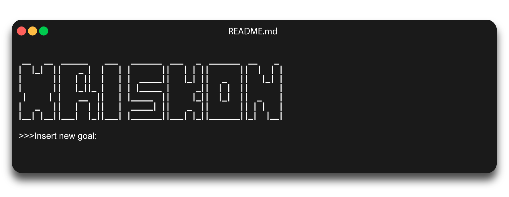
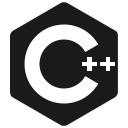
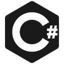
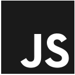

<h1 align="center">Chris Konstantopoulos || xriskon</h1>

</img>

<h2 align="center">Languages / Tools</h2>

    </img>
    </img>
    </img>
    </img>
    </img>
    </img>
    </img>
    </img>
    </img>
    </img>
    </img>

